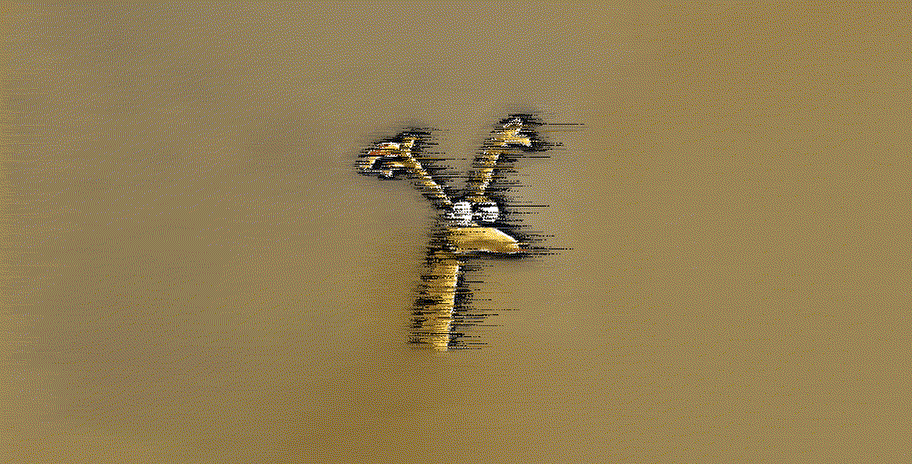
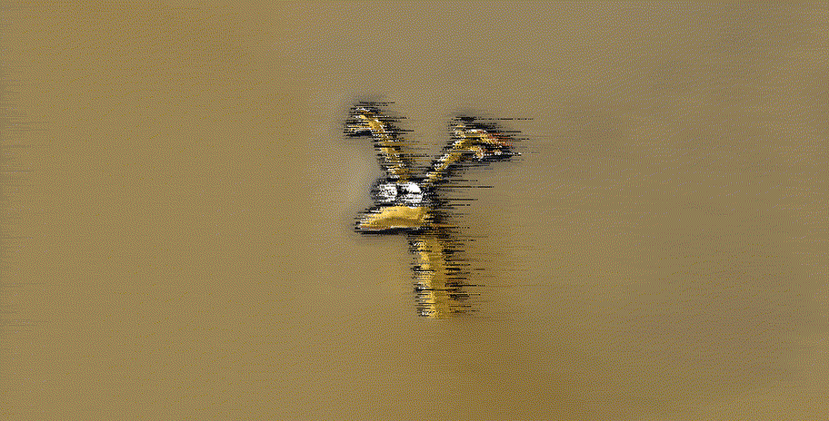
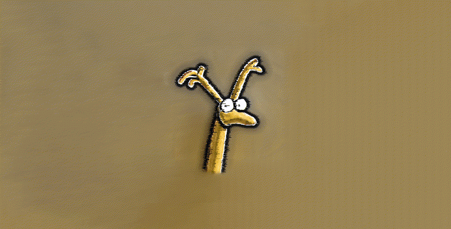
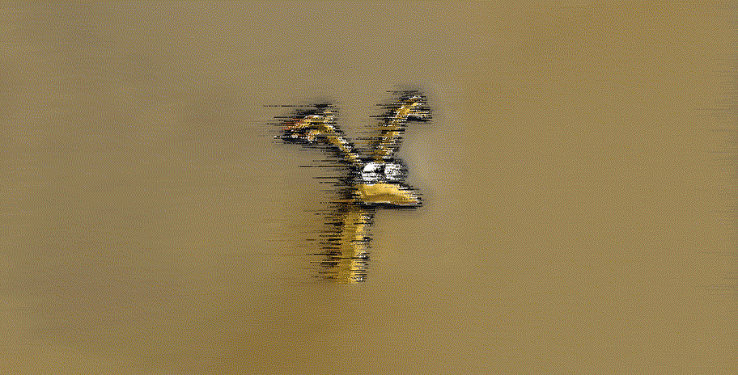
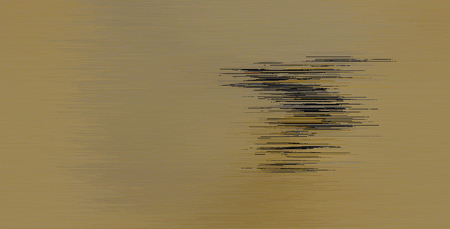
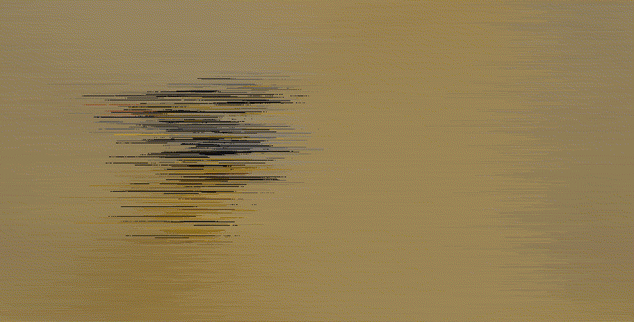

<b>Hi there 👋</b>

PixelWind

`./main.exe ".\smallerbannerCopy - Copy.png" pxlBleed 17 4 17`

  
p1

  

`./main.exe ".\smallerbannerCopy.png" pxlBleed 17 4 17`

  
p2

  

`./main.exe ".\smallerbannerCopy - Copy.png" pxlWind 7 2 20`

  
still

  

FFmpeg

`ffmpeg -i p2.gif -filter_complex "hflip" p2_flip.gif`

  
flip p2

  

`ffmpeg -i p1.gif -filter_complex "reverse" p1_rev.gif`

  
reverse p1

  

`ffmpeg -i p2_flip.gif -filter_complex "reverse" p2_flip_rev.gif`

  
reverse p2

  

`ffmpeg -i p1.gif -i p1_rev.gif -filter_complex '[0:0] [1:0] concat=n=2:v=1[v]' -map '[v]' p1_concat.gif`

  
boomerang p1

  

`ffmpeg -i p2_flip.gif -i p2_flip_rev.gif -filter_complex '[0:0] [1:0] concat=n=2:v=1[v]' -map '[v]' p2_concat.gif`

  
boomerang p2

  

`ffmpeg -i p1_concat.gif -i still.gif -filter_complex '[0:0] [1:0] concat=n=2:v=1[v]' -map '[v]' p1still_concat.gif`

  
add pause

  

`ffmpeg -i p1still_concat.gif -i p2_concat.gif -filter_complex '[0:0] [1:0] concat=n=2:v=1[v]' -map '[v]' p1p2_concat.gif`

  
combine

  

<!--
**zigzag1001/zigzag1001** is a ✨ _special_ ✨ repository because its `README.md` (this file) appears on your GitHub profile.

Here are some ideas to get you started:

- 🔭 I’m currently working on ...
- 🌱 I’m currently learning ...
- 👯 I’m looking to collaborate on ...
- 🤔 I’m looking for help with ...
- 💬 Ask me about ...
- 📫 How to reach me: ...
- 😄 Pronouns: ...
- ⚡ Fun fact: ...
-->
